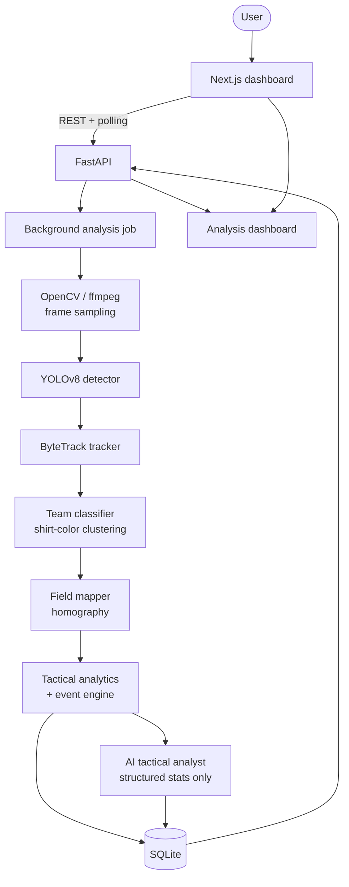

# SoccerVision

Upload a full-field soccer match video and get automated computer-vision
tactical analysis: player and ball detection, multi-player tracking, team
classification, camera-to-pitch field mapping, tactical metrics, numerical
advantage detection, and AI-generated coaching insights layered on top of
the computer-vision facts.

**This is an upload-based batch analysis tool.** It does not process live
video, webcam/browser streams, or RTSP — see [Known limitations](#known-limitations).

## What it does

1. Accepts an uploaded MP4/MOV/AVI match video.
2. Detects players and the ball (YOLOv8).
3. Tracks each player across the video with a persistent ID (ByteTrack).
4. Classifies players into two teams by shirt color (HSV clustering).
5. Maps camera-space positions onto a normalized 0–100 x 0–100 pitch (homography).
6. Computes tactical metrics: width, depth, compactness, spacing, defensive
   line height, zone occupancy, and a heuristic formation estimate.
7. Detects numerical advantages ("4v3 overload in the left final third") and
   other rule-based tactical events.
8. Visualizes all of the above on a synced video + top-down pitch dashboard.
9. Generates short, coaching-style tactical commentary from an LLM (or a
   deterministic fallback when no API key is configured) — fed only the
   structured stats above, never raw video.

## Architecture



Route handlers, computer-vision code, analytics, and storage are kept in
separate modules throughout (see [Repository layout](#repository-layout))
so any stage — the detector, the tracker, the team classifier, the AI
provider — can be swapped independently.

## Technology stack

- **Frontend**: Next.js (App Router), TypeScript, React, Tailwind CSS,
  HTML5 `<video>`, inline SVG for the tactical pitch, Plotly for the team
  shape comparison chart.
- **Backend**: Python, FastAPI, Pydantic / pydantic-settings, SQLAlchemy,
  OpenCV, ffmpeg (via Homebrew/apt on the host).
- **Computer vision**: Ultralytics YOLOv8 (`yolov8n.pt`, COCO-pretrained),
  Ultralytics' built-in ByteTrack, scikit-learn (KMeans for team-color
  and formation clustering).
- **Storage**: SQLite for local dev; local filesystem for uploaded/processed
  video. Both are structured to be swapped (Postgres via `DATABASE_URL`,
  S3/Azure Blob by reimplementing `app/services/storage.py`) without
  touching callers.

## Computer vision pipeline

### Player & ball detection (`backend/app/cv/detector.py`)

Wraps Ultralytics YOLOv8 (`yolov8n.pt`) behind a `Detector.detect(frame) ->
list[Detection]` interface. COCO class `0` ("person") is treated as
`player`; class `32` ("sports ball") is treated as `ball`. **COCO has no
"referee" class** — referees are detected as generic `player` and are a
known, documented edge case (see Limitations), not silently pretended away.
If the model fails to load, a `NullDetector` keeps the pipeline from
crashing (returns zero detections instead).

### Player tracking (`backend/app/cv/tracker.py`)

Uses Ultralytics' bundled ByteTrack (`bytetrack.yaml`) via
`model.track(..., persist=True)` — no separate tracking service or extra
model download. Exposed behind its own `Tracker.update(frame) ->
list[TrackedObject]` interface, sharing the detector's YOLO weights so the
model is only loaded once per job.

### Team classification (`backend/app/cv/team_classifier.py`)

Deliberately simple and explainable, not a trained classifier: crops each
player's upper-torso region, takes the dominant HSV hue (filtering out
grass/shadow/white-line pixels), and clusters all players in a video into
two groups with KMeans. Returns `{"team": "home"|"away", "confidence":
float}`. Goalkeepers are a known edge case — differently-colored kits are
not specially handled, per the hackathon-MVP scope in the spec.

### Field mapping (`backend/app/cv/field_mapper.py`)

Converts camera-space pixel coordinates to normalized pitch coordinates
(`x: 0`=left goal line → `100`=right goal line, `y: 0`=top touchline →
`100`=bottom touchline) via `cv2.getPerspectiveTransform`. The MVP assumes
a fixed camera that already frames the whole pitch corner-to-corner
(configurable 4-point homography, not auto-detected pitch-line recognition)
— see Limitations.

## Tactical metrics (`backend/app/analytics/`)

- **`spacing.py`**: team width, depth, centroid, average player spacing,
  a 0–1 compactness score, and defensive line height.
- **`formations.py`**: heuristic formation estimate (e.g. `4-3-3`) via 1D
  KMeans clustering of outfield players by depth, picking 3 or 4 lines by
  silhouette score. Always returned with a `confidence` and
  `formation_is_heuristic: true` — never claimed as ground truth.
- **`zones.py`**: the 3×3 pitch zone grid (defensive/middle/final thirds ×
  left/central/right) used by both advantage detection and third-occupancy
  counts.
- **`advantages.py`**: **numerical advantage detection** — compares home
  vs. away player counts per zone and flags overloads (e.g. `4v3`) when the
  margin and player count clear a minimum-signal threshold.
- **`possession.py`**: a proximity heuristic (nearest player to the ball
  per sampled frame) — always surfaced as `possession_estimate` and
  labeled estimated, never presented as verified possession.
- **`events.py`**: a rule-based tactical event engine that turns the above
  into a timestamped, throttled event stream (numerical advantages,
  excessive width/depth, low compactness), operating only on structured
  analytics — never on raw video frames.

## AI tactical analyst (`backend/app/services/ai_analyst.py`)

Receives **only** the structured stats above (never video or frames) and
asks an LLM for 3–5 short, coaching-style observations that must reference
only the given numbers. If `AI_API_KEY` isn't set, or the API call fails,
a deterministic rule-based generator produces the same shape of output
from the same stats — so the product is fully demoable with zero external
dependencies. Every insight in the API/UI carries a `source` of either
`ai_interpretation` or `rule_based_fallback`, and the dashboard visibly
labels which one it's showing — computer-vision facts and AI interpretation
are never blended without attribution.

## Repository layout

```
soccer-vision/
├── frontend/            Next.js app (app/, components/, lib/, types/, hooks/)
├── backend/
│   └── app/
│       ├── api/         FastAPI routers only — no business logic
│       ├── core/        settings, logging
│       ├── models/      SQLAlchemy models + DB session
│       ├── schemas/     Pydantic request/response contracts
│       ├── cv/          detector.py, tracker.py, team_classifier.py, field_mapper.py
│       ├── analytics/   spacing.py, formations.py, possession.py, zones.py, advantages.py, events.py
│       ├── services/    video_processor.py, analysis_service.py, ai_analyst.py, storage.py
│       └── workers/     background job execution
├── data/uploads/        uploaded video (gitignored)
├── data/processed/      annotated output video (gitignored)
├── docs/                implementation plan
├── docker-compose.yml   optional containerized run
└── .env.example
```

## Environment variables

Copy `.env.example` to `.env` (repo root, read by the backend) and
`frontend/.env.example` to `frontend/.env.local`.

| Variable | Purpose | Notes |
|---|---|---|
| `DATABASE_URL` | SQLAlchemy connection string | SQLite by default; swap for Postgres later |
| `UPLOAD_DIR` / `OUTPUT_DIR` | Local video storage paths | Swap for S3/Azure by reimplementing `services/storage.py` |
| `MODEL_PATH` | YOLO weights | `yolov8n.pt` — auto-downloaded from Ultralytics' public GitHub release on first use |
| `PROCESSING_FPS` | Frames/sec actually analyzed | Lower = faster, coarser trajectories |
| `CONFIDENCE_THRESHOLD` | Min. YOLO confidence kept | |
| `MAX_PROCESSED_FRAMES` | Hard cap on frames processed per job | Keeps demo processing time/memory bounded |
| `AI_API_KEY` | LLM API key | **Left blank by default — get your own key.** Never committed. |
| `AI_API_BASE_URL` / `MODEL_NAME` | LLM endpoint/model | Default: Anthropic's public Messages API, `claude-sonnet-5` |
| `CORS_ORIGINS` | Allowed frontend origin(s) | |
| `NEXT_PUBLIC_API_BASE_URL` (frontend) | Backend URL the browser calls | |

### How external connections are configured

No secrets are invented anywhere in this repo. `MODEL_PATH`,
`AI_API_BASE_URL`, and `MODEL_NAME` are public, non-secret configuration
values taken from official Ultralytics/Anthropic documentation. The only
value you must supply yourself is `AI_API_KEY` — get one from
[console.anthropic.com](https://console.anthropic.com); leaving it blank
is fully supported and falls back to rule-based insights.

## Running locally

Requires Python 3.12+, Node 20+, and ffmpeg (`brew install ffmpeg` / `apt
install ffmpeg`). No cloud account or GPU is required.

```bash
# 1. Environment
cp .env.example .env
cp frontend/.env.example frontend/.env.local

# 2. Backend
cd backend
python3 -m venv .venv && source .venv/bin/activate
pip install -r requirements.txt
uvicorn app.main:app --reload --port 8000

# 3. Frontend (separate terminal)
cd frontend
npm install
npm run dev
```

Open http://localhost:3000, upload a video, and watch the dashboard
populate as the job progresses through its stages.

### Demo dataset

You don't need a real match clip to try the pipeline: `python3
backend/scripts/generate_demo_video.py` downloads nothing new (it reuses
`data/demo_assets/zidane.jpg`, Ultralytics' own public sample photo of
real soccer players) and writes a short synthetic `demo_match.mp4` with
subtle pan/zoom, so YOLO has real people to detect. For an actual
tactical demo, drop any broadcast/tactical-cam match clip (MP4/MOV/AVI)
anywhere on disk and upload it through the UI — nothing needs to be
pre-placed in `data/uploads/`; the app manages that itself per upload.

## Example API calls

```bash
# Create an analysis job
curl -X POST http://localhost:8000/api/v1/analyses \
  -F "file=@match.mp4"
# => {"analysis_id": "abc123", "status": "queued"}

# Poll status
curl http://localhost:8000/api/v1/analyses/abc123/status
# => {"analysis_id": "abc123", "status": "processing", "stage": "tracking_players", "progress": 35, ...}

# Full result once completed
curl http://localhost:8000/api/v1/analyses/abc123
curl http://localhost:8000/api/v1/analyses/abc123/metrics
curl http://localhost:8000/api/v1/analyses/abc123/events
curl http://localhost:8000/api/v1/analyses/abc123/players
curl http://localhost:8000/api/v1/analyses/abc123/timeline
```

## Testing

```bash
cd backend && source .venv/bin/activate && python3 -m pytest -q
```

Covers upload validation, detection/tracking schema shape, team
classification, homography round-tripping, formation estimation,
numerical-advantage detection (including a synthetic 4-vs-3 shared-zone
case), tactical event generation/throttling, and a real end-to-end
API integration test that runs the full YOLO/ByteTrack/analytics
pipeline against the generated demo video.

## Known limitations

- **Batch only** — no live/webcam/RTSP ingestion, by design.
- **Referees** are detected as generic players (COCO has no referee
  class) and may be misclassified into a team or reported at low
  confidence.
- **Field mapping** uses a fixed 4-point homography (default: full camera
  frame = full pitch); it does not auto-detect pitch lines, and assumes
  a single unmoving camera for the whole clip.
- **Team attacking direction** is assumed fixed for the whole video (home
  always attacks +x) — a real match's half-time side swap isn't detected.
- **Formation** and **possession** are explicitly heuristic/estimated —
  surfaced with confidence scores and labels, never claimed as exact.
- **Goalkeepers** aren't specially handled in team classification.
- Processing time/memory is bounded by `MAX_PROCESSED_FRAMES`; very long
  videos are truncated rather than processed in full.

## Future improvements

- Auto-detected pitch-line homography instead of manual corner config.
- A soccer-specific fine-tuned detector instead of COCO-pretrained YOLO
  (would add a real referee class and improve ball recall).
- Half-detection so attacking direction can flip mid-match.
- Pose-based events (tackles, passes) using YOLO-Pose.
- Durable job queue (Celery/RQ) instead of in-process background tasks,
  and object storage (S3/Azure Blob) instead of local disk, for
  multi-worker deployments.
